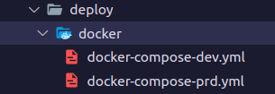
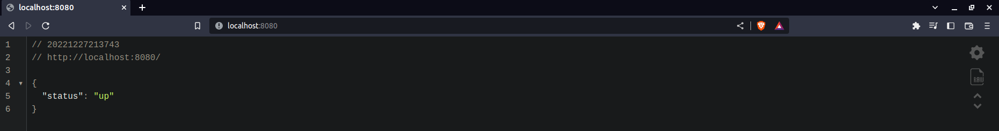
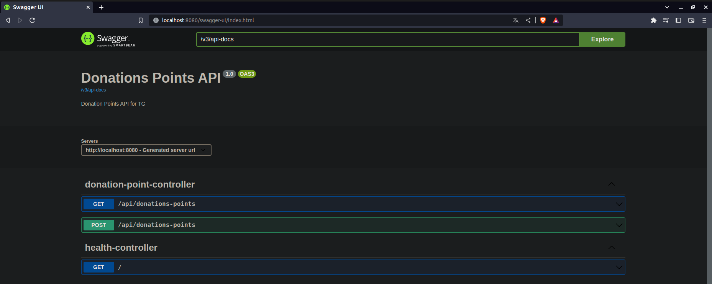

# API Donations Points

API que armazena endereços de pontos de coleta de agasalhos para doação. Esses pontos são coletados a partir de um processo de **Web Scraping** feito pela aplicação [Donations Points Scraping](https://github.com/PedroHPAlmeida/fatec-tg-scraping-donations-points).

O objetivo destas duas aplicações em conjunto é fazer um "compilado" de pontos de coleta de agasalhos, independente de instituições. Deixando as informações centralizadas em um único lugar e permitindo a fácil consulta.
______
## Tecnologias utilizadas

* Java e Spring para desenvolvimento da API;
* Bancos de dados H2 (em memória) e MySQL; 
* Docker para conteinerizar a aplicação e o banco de dados facilitando o desenvolvimento local;
* Docker Compose para subir os múltiplos conteiners da aplicação (conteiner da aplicação e do banco);
* Terraform para provisionar a infraestrutura na cloud AWS;
* Cloud AWS para realizar o deploy da aplicação. Recursos utilizados: AWS Elastic Beanstalk, Amazon S3 e Amazon Relational Database Service (RDS);
* GitHub Actions para CI e CD:
    - Automação de testes e build da aplicação;
    - Atualização automática da imagem docker da aplicação no repositório do [DockerHub Repository - Pedro](https://hub.docker.com/repository/docker/pedro6571/fatec-tg-api-donations-points);
    - Entrega do software em ambiente produtivo de forma automática. 

______
## Como executar o projeto

1. Clone este repositório:

```
git clone https://github.com/PedroHPAlmeida/fatec-tg-api-donations-points.git
```

2. Entre na pasta onde se encontram os arquivos ```docker-compose```:
```
cd deploy/docker
```


3. Nesta pasta há dois arquivos: ```docker-compose-dev.yml``` e ```docker-compose-prd.yml```. O objetivo do arquivo ```-dev``` é simular o ambiente de desenvolvimento, contendo um banco de dados H2 (em memória). De forma semelhante o arquivo ```-prd``` simula o ambiente de produção, contendo um banco de dados MySQL. Para executar a aplicação, execute os seguintes comandos:

Para simular o ambiente de dev:
```
docker compose -f docker-compose-dev.yml up -d
```
Para simular o ambiente de prd:
```
docker compose -f docker-compose-prd.yml up -d
```
A aplicação estará em execução na porta 8080:




4. Para buscar dados da API utilize o seguinte endpoint:

```bash
curl --location --request GET 'localhost:8080/api/donations-points'
```

5. Para salvar dados utilize o seguinte endpoint:
```bash
curl --location --request POST 'localhost:8080/api/donations-points' \
     --header 'Content-Type: application/json' \
     --data-raw '{
     "name": "string",
     "cep": "string",
     "state": "string",
     "city": "string",
     "district": "string",
     "street": "string",
     "number": "string",
     "lng": 0,
     "lat": 0
}'
```

6. O Swagger da aplicação se encontra no endereço: http://localhost:8080/swagger-ui/index.html

______
